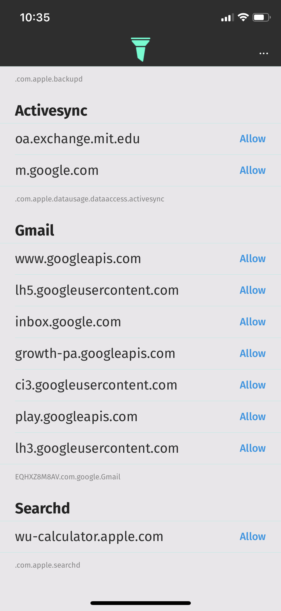

# Sift app
Sift shows you what every app on your phone is really doing. Uncover network traffic in real-time for every app on your phone. Create rules to block sites like ads and tracking pages.

- Inspect network traffic
- Monitor background activity
- Block bad sites and tracking pages
- iOS Developers: debug networking in your live apps

## About
Sift can answer questions like: are apps tracking me even if I disable analytics? are apps malicious? are they connecting to strange urls? are they doing network activity in the background?

**Inspect network traffic for any app on your phone**. Using push notifications, Sift shows you real-time network requests made by other apps. 

**Monitor background activity**. Sift can even show you what network requests apps are making in the background.

**Create rules to block urls like tracking sites, ads, etc**. Use Sift to block any site you don't like for every app on your phone.

**Debugging tool for developers** Use Sift to debug network traffic for your production app: inspect background activity, see how your app handles connection failures to certain sites, etc.

**Sift is completely private** Sift never shares or sends your network traffic data anywhere. Data that Sift collects never leaves your phone.

## Examples
Sift shows you what an app is doing by pushing a notification in real-time. Later you can open Sift and create rules for blocking sites.

    
    
    
    

## FAQ
### Why isn't Sift on the App Store?
It turns it out that network content filters are not permitted for regular app store apps (it only works in supervised device mode). So I decided to release the source code instead -- any donations are greatly appreciated :)

### How do I run this on my own device?
Change the development team to your own in both the app and extensions targets, search for occurences of  "`in.alexgr.`" in the project and replace each one with your own team identifier. Follow this open-source contributed [guide](https://github.com/agrinman/sift-ios/blob/master/docu/HowToInstall/README.md) for more help.

### Is there XCode 10 support?
Yep -- just switch to the `xcode-10` branch.
