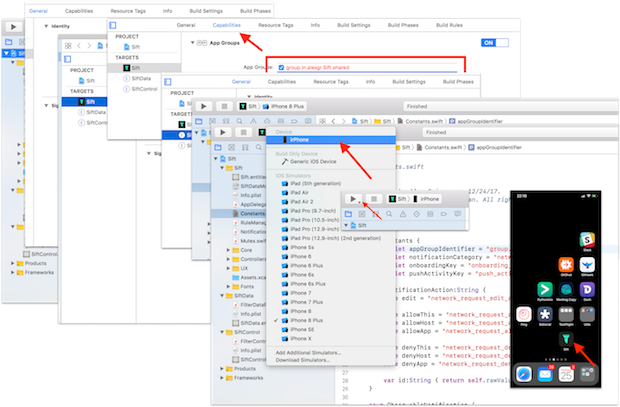

# What changed in this fork?

## Not much, but some!

### UI

* Moved to a navigation style presentation where 1st screen shows all apps known to Sift. On choosing an app, all the rules are displayed for the app in another view.
    * Why? Because when you have a lot of apps, showing them in a single view is overwhelming. Can't reach a rule without search.
* Apps are now shown in alphabetic order now.

### Technical

* Move away from submodules to pods
* Fix gitignore
* A lot of whitespace fixes to make code more readable

### Questions unanswered

1. How is the core data holding up?!
    * Core data is unable to handle write from multiple processes, it isn't designed for that function. Yet, [FilterControlProvider#L43](https://github.com/ayushgoel/sift-ios/blob/master/SiftControl/FilterControlProvider.swift#L43) and at multiple places in [FilterSettingsController](https://github.com/ayushgoel/sift-ios/blob/master/Sift/Controllers/FilterSettingsController.swift#L327) the object graph is modified.
2. Why are there so many types of rules?!
    * There are two rules, one an entity in data model and another is the struct Rule.
    * A single entity type encapsulating an app and a host should've been enough for all our needs. I am yet to find a use case for wild cards.
    * The struct Rule has three types handling the case of having rules per app and per host. From what I could understand, it eases implementation of "Drop for all apps". Though I guess same could be achieved by **abstracting this idea in controller/business layer instead of data layer**. The code for table view is difficult to understand because of the code handling all the different types.

---

# Sift app
Sift shows you what every app on your phone is really doing. Uncover network traffic in real-time for every app on your phone. Create rules to block sites like ads and tracking pages.

- Inspect network traffic
- Monitor background activity
- Block bad sites and tracking pages
- iOS Developers: debug networking in your live apps

## If Sift is useful to you...please support ongoing development!
BTC: **3JtkeGRHyJbDjiwPMX7PACQYEtReHgRDW8**

PayPal:

<a href="https://www.paypal.com/cgi-bin/webscr?cmd=_s-xclick&encrypted=-----BEGIN%20PKCS7-----MIIHLwYJKoZIhvcNAQcEoIIHIDCCBxwCAQExggEwMIIBLAIBADCBlDCBjjELMAkGA1UEBhMCVVMxCzAJBgNVBAgTAkNBMRYwFAYDVQQHEw1Nb3VudGFpbiBWaWV3MRQwEgYDVQQKEwtQYXlQYWwgSW5jLjETMBEGA1UECxQKbGl2ZV9jZXJ0czERMA8GA1UEAxQIbGl2ZV9hcGkxHDAaBgkqhkiG9w0BCQEWDXJlQHBheXBhbC5jb20CAQAwDQYJKoZIhvcNAQEBBQAEgYCzsGt%2Bv0EClVGz2IZcWhkYECj8wdY07%2Fr4ZelUFVB1DpbwKmCu5mOii0oYAhq8nFl11PDEQpAPO9p60ASqssI4k7A8bWtbL7FFIqBU4Wd3y%2BfuAafNbS%2Bner%2BZoIYlarPM59EMufFLSZaVTOGKRaCeq3Lgw11uV9xxuXiaEnNKpjELMAkGBSsOAwIaBQAwgawGCSqGSIb3DQEHATAUBggqhkiG9w0DBwQIXQASENYLU8mAgYhgL7Euz1hD6DgDAh%2FiHO%2FAFGe5nJlKxgqTzx2cY5SBsoYROMcFCNTCghGClAW1Ep4PYztqm2W6mie1Zcq2jUlN%2FOsoSUkXpAP2QBxs5BbZ0hSKdoEm%2BaojYFUi3LyMqzhQ1E%2FDe16soXavoj2ARrBtIMYM25FbAvJlEwwyjNudKIk7CBLCJqkXoIIDhzCCA4MwggLsoAMCAQICAQAwDQYJKoZIhvcNAQEFBQAwgY4xCzAJBgNVBAYTAlVTMQswCQYDVQQIEwJDQTEWMBQGA1UEBxMNTW91bnRhaW4gVmlldzEUMBIGA1UEChMLUGF5UGFsIEluYy4xEzARBgNVBAsUCmxpdmVfY2VydHMxETAPBgNVBAMUCGxpdmVfYXBpMRwwGgYJKoZIhvcNAQkBFg1yZUBwYXlwYWwuY29tMB4XDTA0MDIxMzEwMTMxNVoXDTM1MDIxMzEwMTMxNVowgY4xCzAJBgNVBAYTAlVTMQswCQYDVQQIEwJDQTEWMBQGA1UEBxMNTW91bnRhaW4gVmlldzEUMBIGA1UEChMLUGF5UGFsIEluYy4xEzARBgNVBAsUCmxpdmVfY2VydHMxETAPBgNVBAMUCGxpdmVfYXBpMRwwGgYJKoZIhvcNAQkBFg1yZUBwYXlwYWwuY29tMIGfMA0GCSqGSIb3DQEBAQUAA4GNADCBiQKBgQDBR07d%2FETMS1ycjtkpkvjXZe9k%2B6CieLuLsPumsJ7QC1odNz3sJiCbs2wC0nLE0uLGaEtXynIgRqIddYCHx88pb5HTXv4SZeuv0Rqq4%2BaxW9PLAAATU8w04qqjaSXgbGLP3NmohqM6bV9kZZwZLR%2FklDaQGo1u9uDb9lr4Yn%2BrBQIDAQABo4HuMIHrMB0GA1UdDgQWBBSWn3y7xm8XvVk%2FUtcKG%2BwQ1mSUazCBuwYDVR0jBIGzMIGwgBSWn3y7xm8XvVk%2FUtcKG%2BwQ1mSUa6GBlKSBkTCBjjELMAkGA1UEBhMCVVMxCzAJBgNVBAgTAkNBMRYwFAYDVQQHEw1Nb3VudGFpbiBWaWV3MRQwEgYDVQQKEwtQYXlQYWwgSW5jLjETMBEGA1UECxQKbGl2ZV9jZXJ0czERMA8GA1UEAxQIbGl2ZV9hcGkxHDAaBgkqhkiG9w0BCQEWDXJlQHBheXBhbC5jb22CAQAwDAYDVR0TBAUwAwEB%2FzANBgkqhkiG9w0BAQUFAAOBgQCBXzpWmoBa5e9fo6ujionW1hUhPkOBakTr3YCDjbYfvJEiv%2F2P%2BIobhOGJr85%2BXHhN0v4gUkEDI8r2%2FrNk1m0GA8HKddvTjyGw%2FXqXa%2BLSTlDYkqI8OwR8GEYj4efEtcRpRYBxV8KxAW93YDWzFGvruKnnLbDAF6VR5w%2FcCMn5hzGCAZowggGWAgEBMIGUMIGOMQswCQYDVQQGEwJVUzELMAkGA1UECBMCQ0ExFjAUBgNVBAcTDU1vdW50YWluIFZpZXcxFDASBgNVBAoTC1BheVBhbCBJbmMuMRMwEQYDVQQLFApsaXZlX2NlcnRzMREwDwYDVQQDFAhsaXZlX2FwaTEcMBoGCSqGSIb3DQEJARYNcmVAcGF5cGFsLmNvbQIBADAJBgUrDgMCGgUAoF0wGAYJKoZIhvcNAQkDMQsGCSqGSIb3DQEHATAcBgkqhkiG9w0BCQUxDxcNMTgwNjA4MTM0NTE5WjAjBgkqhkiG9w0BCQQxFgQUK2tlwCUObpWfh%2F9ANxAavbZvdYIwDQYJKoZIhvcNAQEBBQAEgYCmDPn0HZJuZe5bgowx9Rds91yscd%2FELgrDggObFXIuWZ%2Bjde3GE54JG3404Sd5ar7Qv6NWQnXDbArstFCQkJ3rZuI09vRvuQ55iCkNYVGDr3qCDdOwcOMPfmrnFVcYIG8V0nHpyPzA6AUS0Ca2vobzzRb6Kf588%2FsDVHjsCTi2dw%3D%3D-----END%20PKCS7-----">
    
</a>

## About
Sift can answer questions like: are apps tracking me even if I disable analytics? are apps malicious? are they connecting to strange urls? are they doing network activity in the background?

**Inspect network traffic for any app on your phone**. Using push notifications, Sift shows you real-time network requests made by other apps. 

**Monitor background activity**. Sift can even show you what network requests apps are making in the background.

**Create rules to block urls like tracking sites, ads, etc**. Use Sift to block any site you don't like for every app on your phone.

**Debugging tool for developers** Use Sift to debug network traffic for your production app: inspect background activity, see how your app handles connection failures to certain sites, etc.

**Sift is completely private** Sift never shares or sends your network traffic data anywhere. Data that Sift collects never leaves your phone.

## Examples
Sift shows you what an app is doing by pushing a notification in real-time. Later you can open Sift and create rules for blocking sites.

    
    
    
    

## FAQ
### Why isn't Sift on the App Store?
It turns it out that network content filters are not permitted for regular app store apps (it only works in supervised device mode). So I decided to release the source code instead -- any donations are greatly appreciated :)

### How do I use it/install it?
Make sure you have XCode installed. Clone the code, update submodule (`git submodule update --init --recursive`). Open the .xcodeproj file. Then:
1. Change the development team to your own in both the app and extensions targets
2. Search for occurences of  "`in.alexgr.`" in the project and replace each one with your own team identifier. 
3. Connect your iDevice and hit run. 

Note: you might have to authorize XCode to deploy to your device/sign into iCloud in XCode.

You can find a [step-by-step workthrough in ". docu/HowToInstall/README.md"](./docu/HowToInstall/README.md)

### Is there XCode 10 support?
Yep -- just switch to the `xcode-10` branch.
