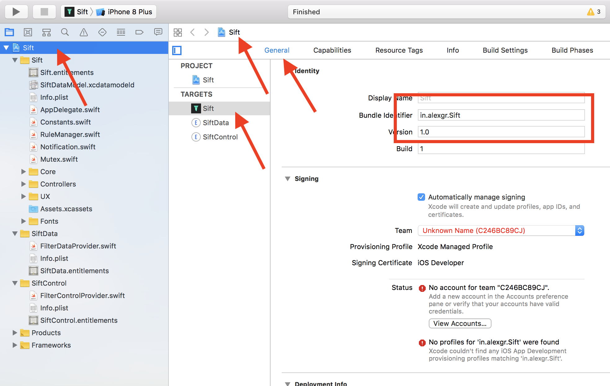
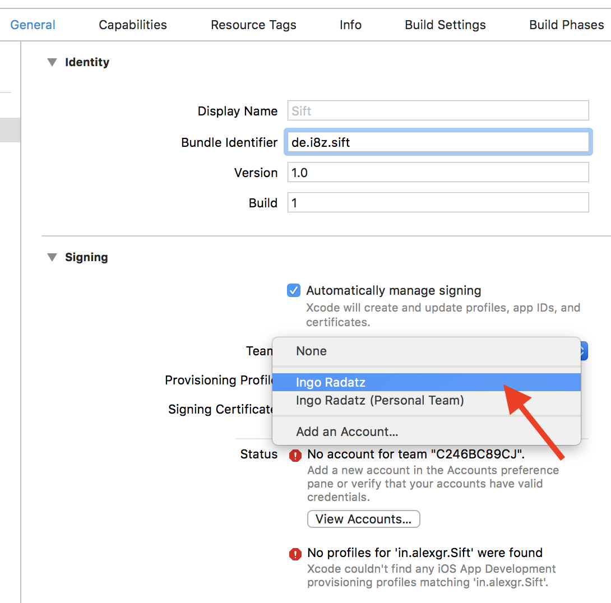
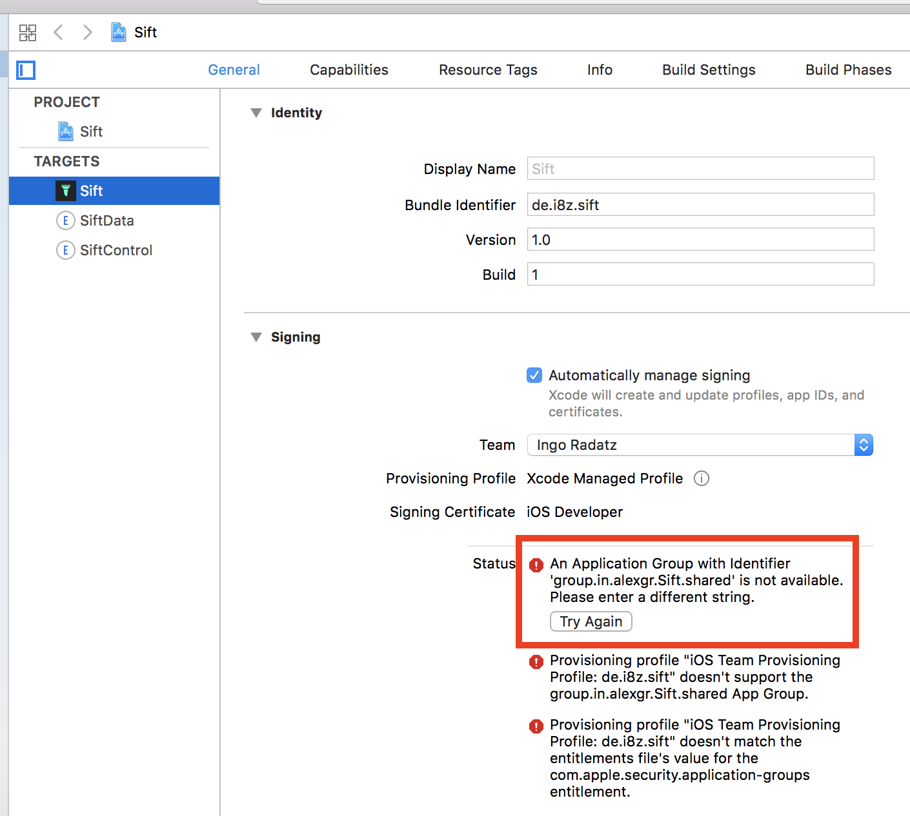
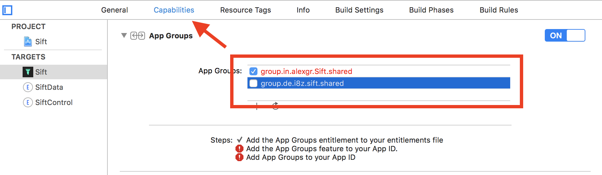
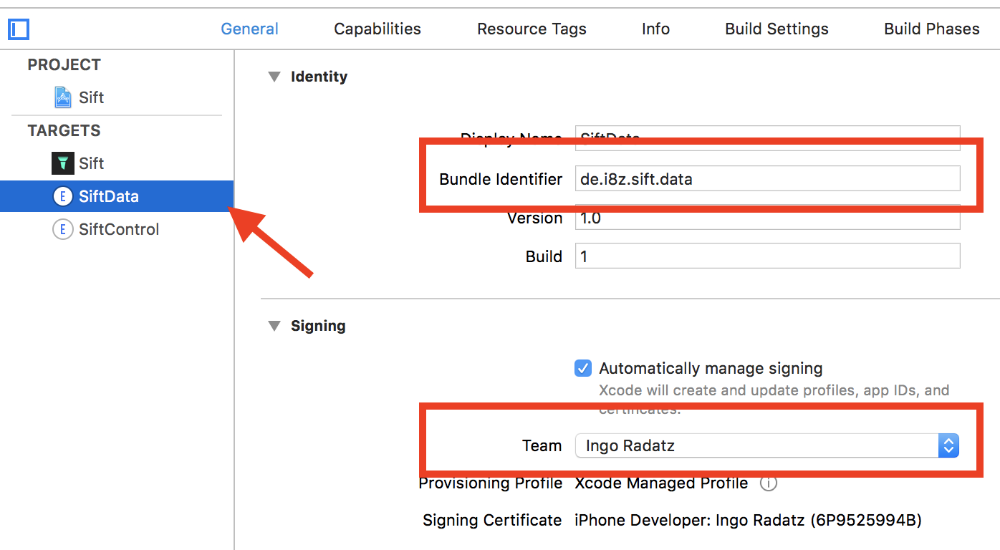
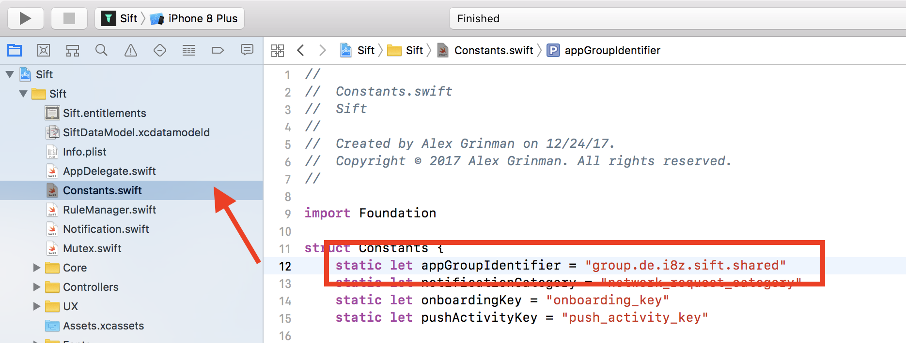

# How to install the Sift app on your own device

This was made with:
* Xcode version 9.4.1
* Git  2.15.2
* MacOs 10.13.5 (High Sierra)

(This howto doc was created by a @llabball) 

```
$ git clone git@github.com:agrinman/sift-ios.git
$ cd sift-ios
```

## Update the submodules
```
$ git submodule update --init --recursive
```

## Open the project
```
$ open Sift/Sift.xcodeproj
```

## Update the "Sift", "SiftData", and "SiftControl" Targets

* **Choose your "Bundle identifier"**

  You have to choose your own unique identifier. I've replaced `in.alexgr.Sift` with my "de.i8z.sift"

  

* **Choose your team for signing**

  You cannot choose "(Personal Team)"

  

  It results in:
  
  

* **Choose the "app group"**
  
  


Repeat the steps from the configuration of the target "Sift".
For example:

* **Bundle identifier**: `de.i8z.sift.data`
* **Team**: same as in target "Sift"
* **App group**: same as in target "Sift"



Repeat the steps from the configuration of the target "Sift".
For example:

* **Bundle identifier**: `de.i8z.sift.data`
* **Team**: same as in target "Sift"
* **App group**: same as in target "Sift"

### Configure the target "SiftControl"

Repeat the steps from the configuration of the target "Sift".
I've chosen

* **Bundle identifier**: `de.i8z.sift.control`
* **Team**: same as in target "Sift"
* **App group**: same as in target "Sift"

### Update "Sift/Constants.swift"



### Now build + run
You should be all set now.
