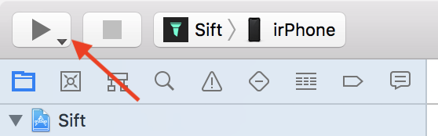
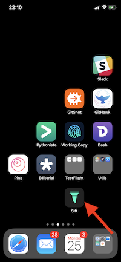

# How to install the Sift app

This was made with:
* Xcode version 9.4.1
* Git  2.15.2
* MacOs 10.13.5 (High Sierra)

(This howto doc was created by a @llabball) 

<!-- START doctoc generated TOC please keep comment here to allow auto update -->
<!-- DON'T EDIT THIS SECTION, INSTEAD RE-RUN doctoc TO UPDATE -->
**Table of Contents**  *generated with [DocToc](https://github.com/thlorenz/doctoc)*

  - [clone the repository](#clone-the-repository)
  - [clone the submodules](#clone-the-submodules)
  - [open repository in Xcode](#open-repository-in-xcode)
    - [configure the target "Sift"](#configure-the-target-sift)
    - [configure the target "SiftData"](#configure-the-target-siftdata)
    - [configure the target "SiftData"](#configure-the-target-siftdata-1)
    - [configure the target "SiftControl"](#configure-the-target-siftcontrol)
    - [configure the file "Sift/Constants.swift"](#configure-the-file-siftconstantsswift)
  - [build the app on your iPhone](#build-the-app-on-your-iphone)

<!-- END doctoc generated TOC please keep comment here to allow auto update -->

## Clone the repo
```
$ git clone git@github.com:agrinman/sift-ios.git
$ cd sift-ios
```

## Update the submodules
```
$ cd git submodule update --init --recursive
```

## Open the project
```
$ open Sift/Sift.xcodeproj
```

## Update the "Sift", "SiftData", and "SiftControl" Targets

* **alter the "Bundle identifier"**

  You have to choose your own unique identifier. I've replaced `in.alexgr.Sift` with my "de.i8z.sift"

  

* **choose your team for signing**

  You cannot choose "(Personal Team)"

  

  It results in:
  
  

* **alter the name of the "app group"**
  
  In the screenshot my group was already displayed because I've created the name in a run before. You've just to click the plus-sign. I've named my group `group.de.i8z.sift.shared`. You can choose whatever you want and have to use it in following configurations.

  


Repeat the steps from the configuration of the target "Sift".
I've chosen

* **Bundle identifier**: `de.i8z.sift.data`
* **Team**: same as in target "Sift"
* **App group**: same as in target "Sift"


Repeat the steps from the configuration of the target "Sift".
I've chosen

* **Bundle identifier**: `de.i8z.sift.data`
* **Team**: same as in target "Sift"
* **App group**: same as in target "Sift"

### configure the target "SiftControl"

Repeat the steps from the configuration of the target "Sift".
I've chosen

* **Bundle identifier**: `de.i8z.sift.control`
* **Team**: same as in target "Sift"
* **App group**: same as in target "Sift"

### configure the file "Sift/Constants.swift"

Remember the App group name you have used in the target configuration and paste it into the Line 12.


## build the app on your iPhone

1. **connect your iPhone with the Mac via USB-cable**

   
2. **select your iPhone from the list of devices**
  

3. **RUN!**

   
  
4. **It done!**

   
